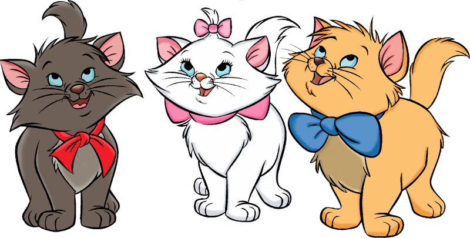

# Chaton
Chaton is an easy-to-use .gif/.webm creator.  
Type a movie title, select the part you want and get your file.

Chaton was made the 2014-10-18 during the fhacktory hackaton in Paris by the
Duchesse team.

## Components

### Berlioz
Berlioz takes a full movie and create animated thumbnails we can stream to the
client.

Berlioz was done with PHP and ffmpeg by Simon Gareste.

### Marie
Marie is the REST+JSON API written in PHP that powers Toulouse and the daemon
that downloads files using Transmission and process them using Berlioz.

Marie uses the Slim framework, Doctrine and a PHP implementation of the
Transmission RPC API.

Marie was done by Léo Peltier.

### Toulouse
Toulouse is the AngularJS frontend to Chaton, it communicates with Marie and
display the files generated by Berlioz.

Toulouse was done by Bastien Abadie.
